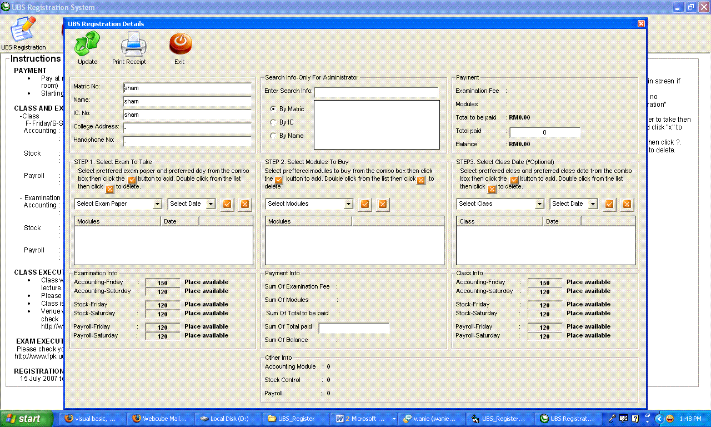



## Basic Registration System

### Description

Example of complete registration system. Demonstrate the use of SQL and also the use of components such as listView,imageList,toolBar,sub procedure with SQL functions. The application also contains example on how to call/display Access report/components from Visual Basic applications
 
### More Info
 

             |
---                |---
**Submitted On**   |2007-10-30 00:15:18
**By**             |[Hisham Sharif](https://github.com/Planet-Source-Code/PSCIndex/blob/master/ByAuthor/hisham-sharif.md)
**Level**          |Intermediate
**User Rating**    |4.5 (18 globes from 4 users)
**Compatibility**  |VB 6\.0
**Category**       |[Complete Applications](https://github.com/Planet-Source-Code/PSCIndex/blob/master/ByCategory/complete-applications__1-27.md)
**World**          |[Visual Basic](https://github.com/Planet-Source-Code/PSCIndex/blob/master/ByWorld/visual-basic.md)
**Archive File**   |[Basic\_Regi20889510302007\.zip](https://github.com/Planet-Source-Code/hisham-sharif-basic-registration-system__1-69562/archive/master.zip)

